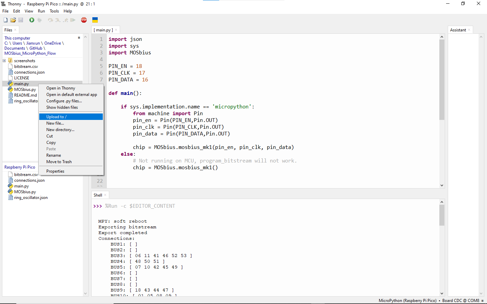
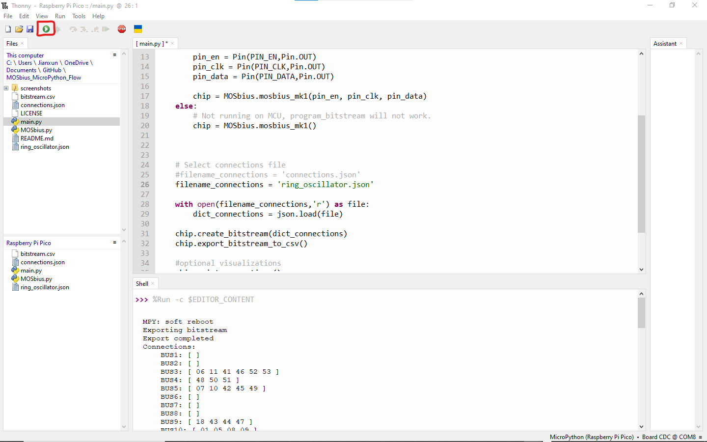

# Python IDE
- Download and install the Thonny Python IDE (https://thonny.org/)
- Alternatively uou can use your favorite IDE and Python distribution. Thonny is recommended by the Raspberry Pi Pico official tutorials.

# Install the MicroPython Firmware
- Open Thonny
- Connect a Rapsberry Pi Pico to your computer with an USB cable while pressing the `BOOTSEL` button.
- The Raspberry Pi Pico should appear as a USB drive.
- In Thonny, click the bottom right corner and select `Install MicroPython`.
- Choose the target RPI Pico variant then click `Install`.

# Upload files
- Click the bottom right corner again and select your board. 
- In the `Files` window, right click `main.py` and select `Upload to /`

- Do the same with `MOSbius.py` and `connections.json`

# Program MOSbius with the Raspberry Pi Pico
- Connect the `EN`, `CLK` and `DATA` pins (pin numbers defined in `main.py`) to the MOSBIUS PCB (top pins) and short the corresponding jumpers on the left.
- (Optional), connect the `LDO` and `GND` pins on the MOSbius PCB to the Raspberry Pi power pin.
- Double click to open `connections.json` from the device, edit and save the connections as needed.
- Double click to open `main.py` from the device, click `Run current script`.
- The console will print out the connections and the bitstream, check them against your `connections.json` file.

- Done
