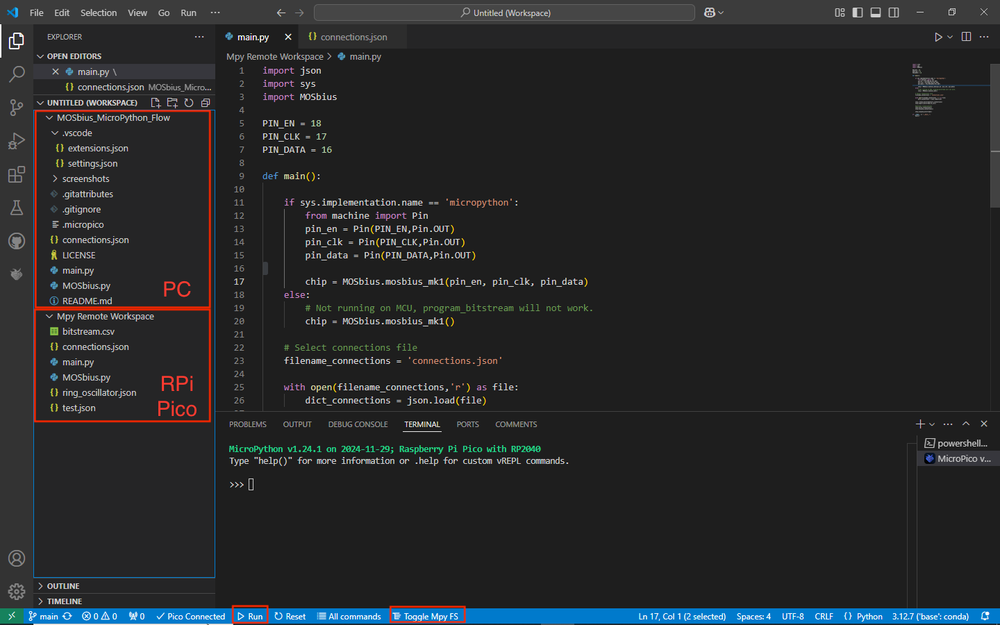

# About
This project is the MicroPython workflow of the MOSbius chip (https://mosbius.org). 
Any MCU platform that is capable of running MicroPython can be used to program the MOSbius but Raspberry Pi Pico is recommended.

# Raspberry Pi Pico
Follow the official tutorials and install MicroPython firmware onto the Raspberry Pi Pico.
https://projects.raspberrypi.org/en/projects/getting-started-with-the-pico

# Python IDE
You can use Thonny (https://thonny.org/), which is recommended by the official tutorial. This is beginner friendly IDE. You can easily move files between you computer and the RPi Pico.

If you are a more experienced Python user, and want a nicer IDE with code completion, you can use the VSCode + MicroPico plugin.
 
# Upload Files
`MOSbius.py`, `main.py`, and `connections.json` are essential files that need to be uploaded to the RPi Pico.

If you are using Thonny, right click them in the files window and select `Upload to /`

If you are using VSCode + MicroPico, you can right click on the files and select `Upload file to Pico`, or `Upload project to Pico`.

# Program MOSbius with the Raspberry Pi Pico
- Connect the `EN`, `CLK` and `DATA` pins (pin numbers defined in `main.py`) to the MOSBIUS PCB (top pins) and short the corresponding jumpers on the left.
- (Optional), connect the `LDO` and `GND` pins on the MOSbius PCB to the Raspberry Pi power pin.
- Double click to open `connections.json` from the device, edit and save the connections as needed.
- Double click to open `main.py` from the device, click `Run current script`.
- The console will print out the connections and the bitstream, check them against your `connections.json` file.

- Done

# Running the flow on non-MicroPython hosts
The `main.py` script can detect if it is running on a MicroPython implementation. If not it will create the MOSbius object without valid GPIO pin configurations. You should be able to create a bitstream from a .json file and export it to `bitstream.csv`, which can be loaded into Scopy to program the MOSbius chip with an ADALM2000 if you don't have a RPI pico available.